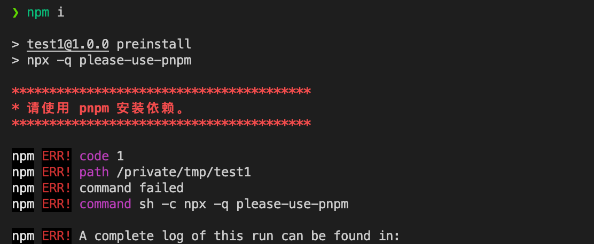

# please-use-pnpm

> 在项目中强制使用 pnpm 作为包管理工具 </br>
> 本仓库严重抄袭 [justjavac/please-use-yarn](https://github.com/justjavac/please-use-yarn)

## 使用

在 `package.json` 文件的 `scripts` 中添加 `preinstall`:

```bash
{
    "scripts": {
        "preinstall": "npx please-use-pnpm"
    }
}
```

## 效果

当使用 `npm i` 或者 `yarn` 安装包时，会报错并停止安装。



**备注**: 如果不想看到 `npx: 1 安装成功，用时 xxxx 秒`，可以使用 `--quiet` 选项(或者 `-q`):

```json
{
  "scripts": {
    "preinstall": "npx -q please-use-yarn"
  }
}
```

## License

[MIT](LICENSE)
